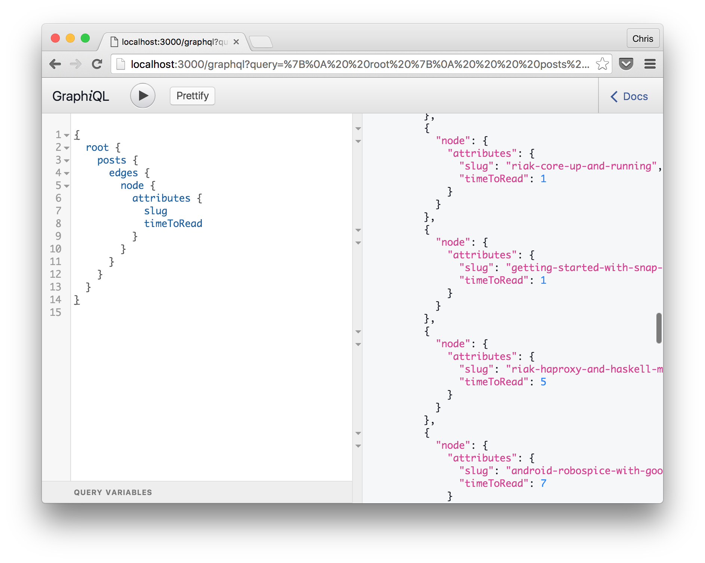

# Developing

```shell
npm i
npm run update-schema
npm start
```

## GraphiQL Data Explorer

```shell
npm run api
```

Then open http://localhost:3000/graphql in your favorite browser to
see GraphiQL.


