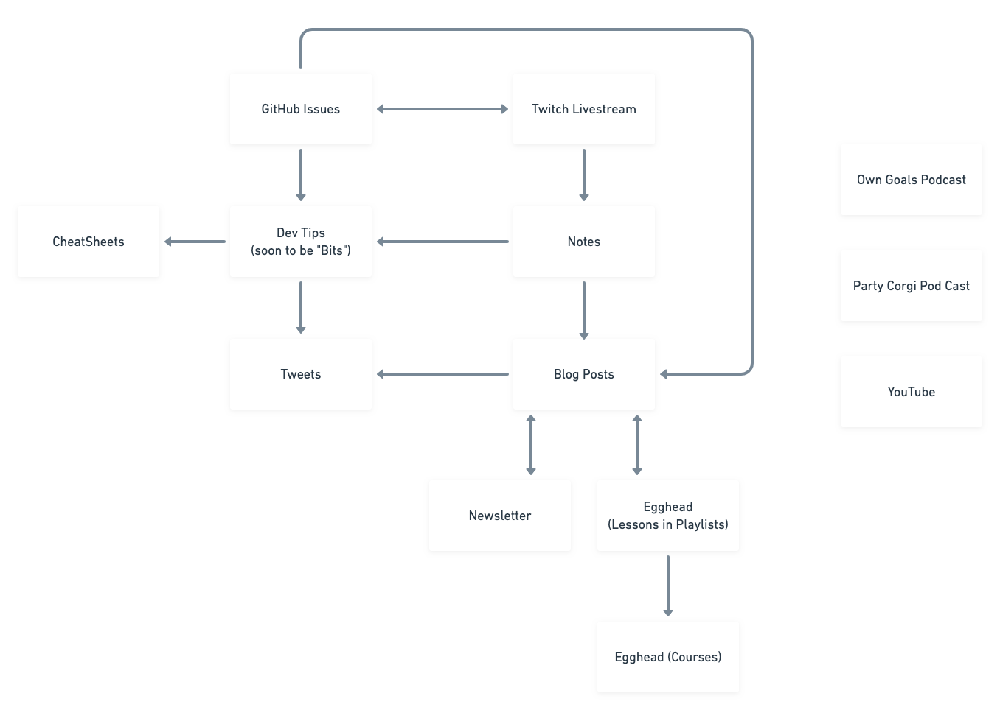

import Layout from "gatsby-theme-blog/src/components/layout";

<Layout location={props.location}>

# My Content Production Process

> note: I'm using the word `content` here to refer to the whole collection of blog posts, snippets, videos, screencasts, podcasts, etc that I produce; Also known as my collective output that is not code or product work. It still sounds weird to my ears and I haven't found a better word.

## Why produce content?

I decided in 2019 to accelerate my ability to produce useful information for myself and for other people. One of the aspects of previous roles I've held that I like the most is the ability to help people grow. Doing this while building a team in a startup environment like Docker is intense and ironically doesn't scale well. I want to reach more people with the knowledge I've accrued over my career. While working closely with individuals is incredibly rewarding there are multiple orders of magnitude difference in the impact I can have between teams I lead and the tens of thousands of people that find my blog, read my Twitter account, watch my videos on Egghead, etc

Similarly to shipping software I've found that the best way to ensure quality is to focus on iterations. Shipping more content more frequently means I get better at shipping content, faster. This is why I optimize for continuity in my production pipeline. I don't want to burn out and crash, I want to keep doing this for the next five years.

## Types of Content

A core principle of my production process is the separation of content into various types. Each has its own purpose and style of writing that allows me leniency in publishing everything from [small, tweetable snippets](https://www.christopherbiscardi.com/devtips) to [really deep dives](https://www.christopherbiscardi.com/post/styles-and-naming).

Here is a rough overview of how I separate the content types and how they flow into each other. It's conceptually accurate but in reality the lines are more blurry than represented here.

Blog posts are my main type of content and Twitter is my main social network. If I had to get rid of everything else I'd keep my personal blog and my Twitter account.

On my personal site there are roughly 3 kinds of content: Blog posts, Notes, and "Dev Tips" (soon to be renamed as "Bits" so that they aren't just dev related).

## Written Content

[Notes](/notes) I take when I'm learning something new, working through something on a livestream, or otherwise need a "caching layer" for my thoughts. I have Notes on topics ranging from Gatsby schema customization to Cilium and BPF networking. Once I take enough Notes on a particular topic, I'll extract a blog post from those Notes and delete the relevant lines from the Note page. Notes are ephemeral.

["Dev Tips" (or Bits)](/devtips) are basically snippets with small explanations. I pull them out of anything I happen to be working on with the purpose of putting them on Twitter. There isn't any "why" you would use each snippet, it's purely "how" to do it. Bits require previously held context to understand. Bits are compiled into linkable "cheatsheets" on my personal site.

Finally [Blog Posts](/post) are my primary content type. They range across a couple different lengths of content, roughly classifiable from daily blog posts which can be much shorter (couple hundred words) to deep dives that are 5000+ words. Blog posts cycle back and forth between my newsletter and egghead. Smaller posts make for good Egghead lessons, which can then be linked to from my posts. This allows me to gradually build up written content, video content, and runnable resources like code projects that all work together on the same topic. It's _really_ important that these are all doable separately for me because the effort and time required to ship it all at once means I spend months refining a 5k+ word deep dive with runnable code and that is easily disrupted. Remember I optimize for continuity and continuity is shipping.

Once I have enough smaller blog posts on a given topic, I combine them into a deep dive that I post to my newsletter with a little editing. After posting to my newsletter I'll also do a more full editing pass with a potential full rewrite on the larger deep dive and post it back to my blog.

This evolving written process allows me to go from a set of Notes to a full book chapter length piece of content. I haven't yet produced enough deep dives on related topics to ship a book but that's something that I could entertain in the future.

## Visual Content

[Livestreams on Twitch](https://www.twitch.tv/chrisbiscardi) serve a couple of purposes. One is to create space for people to feel like they can ask questions. Another is to display my working process since that is something that we don't really see from other engineers. Finally, it's a community building effort. Typically Twitch is not a platform that people _find_ me on, it's a platform that allows me to develop more of a relationship with people. I also have a [Discord Channel](https://discord.gg/S9Gdagv) that allows me to foster more community when I'm not actively livestreaming. This goes back to why I started all of this in the first place; It's hard to develop relationships with people when you only get the occasional tweet to interact. One of the great things about Discord is that people can also help each other out.

[Egghead](https://egghead.io/instructors/chris-biscardi) organizes their content into Lessons, Courses, and Workshops; (Playlists are user-created groups of Lessons). Lessons sometimes come straight from blog posts I've written and sometimes from whatever I happen to be thinking about. A lot of my Golang videos are direct-to-egghead while a lot of my Gatsby content hits my blog posts before becoming egghead videos. I almost always organize my Egghead content into playlists and that's not really because I have to but more because I like creating chains of videos more than one-offs. Courses and workshops require a submission process so require more investment in a larger product. I'm still working through how Courses and workshop production fits in with my other processes.

[YouTube](https://www.youtube.com/channel/UCiSIL42pQRpc-8JNiYDFyzQ) is represented in my content flow, but I haven't yet found a good rhythm for creating videos on that platform. I am concerned about the level of investment and production that needs to happen there, so right now YouTube is basically just an archive of interesting livestreams I've done (since Twitch doesn't save them). This is cool because you can watch me actually [build out the shadowing implementation for Gatsby](https://www.youtube.com/watch?v=Jzx8UrTdYOk&list=PLWtPciJ1UMuBEaMPkTXrhPv2mwe-yRHRb&index=8), [implement support for Child Themes](https://www.youtube.com/watch?v=2WOZmC7B-Ks&list=PLWtPciJ1UMuBEaMPkTXrhPv2mwe-yRHRb&index=7), or [fix bugs](https://www.youtube.com/watch?v=Nz0UXVvqP2Q&list=PLWtPciJ1UMuBEaMPkTXrhPv2mwe-yRHRb&index=9). If you're trying to follow my cutting edge work this is also the place to find a lot of the work I put into PRs like the [gatsby-theme-blog-core implementation](https://www.youtube.com/watch?v=oS4HAWgb5pk&list=PLWtPciJ1UMuBEaMPkTXrhPv2mwe-yRHRb&index=17).

## Audio Content

I currently co-host [Own Goals](https://owngoals.stream/) with [Mark Philpot](https://twitter.com/mark_philpot). Mark handles the audio production so my job is much more focused on coming up with viable topics and talking about them. It's more of a tech talk show than anything else, so the preparation is currently low effort (although we might delve into interviews soon, which will require more research time and upfront investment).

Another podcast I'm working on is tentatively called the Party Corgi Podcast. It is a season-based distribution model that I want to ship at least once a quarter. This makes it really easy for me to fit into my schedule and record different seasons at the same time or separate times. I already have livestreaming as dedicated time each week, so I'm focusing on making the workload here more burst-capable. A 12 episode season could be reasonably completed in two weeks if I could schedule all of the interviews _and_ get all of the research for each done. I do my research before I reach out and I reach out with a pre-defined list of questions I want to ask so people know what they're getting in to.

## Fin

So that's my content production lifecycle. It has allowed me to hit periods of incredible productivity (authoring 7 blog posts in one day, or one every day for the month of January) while also being sustainable. I don't require myself to ship any particular piece of content on any particular timeframe so that makes it easier to avoid burnout. I can switch between blog posts when I feel like it to screen casts when I don't and then back to Bits or Notes when working on heavy code projects.

</Layout>
